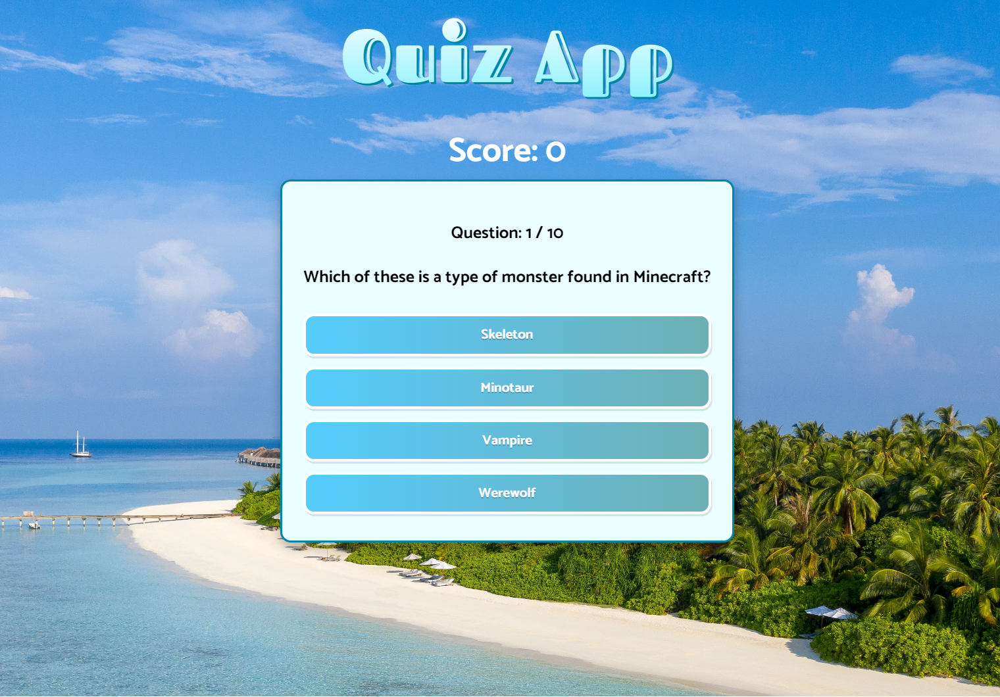
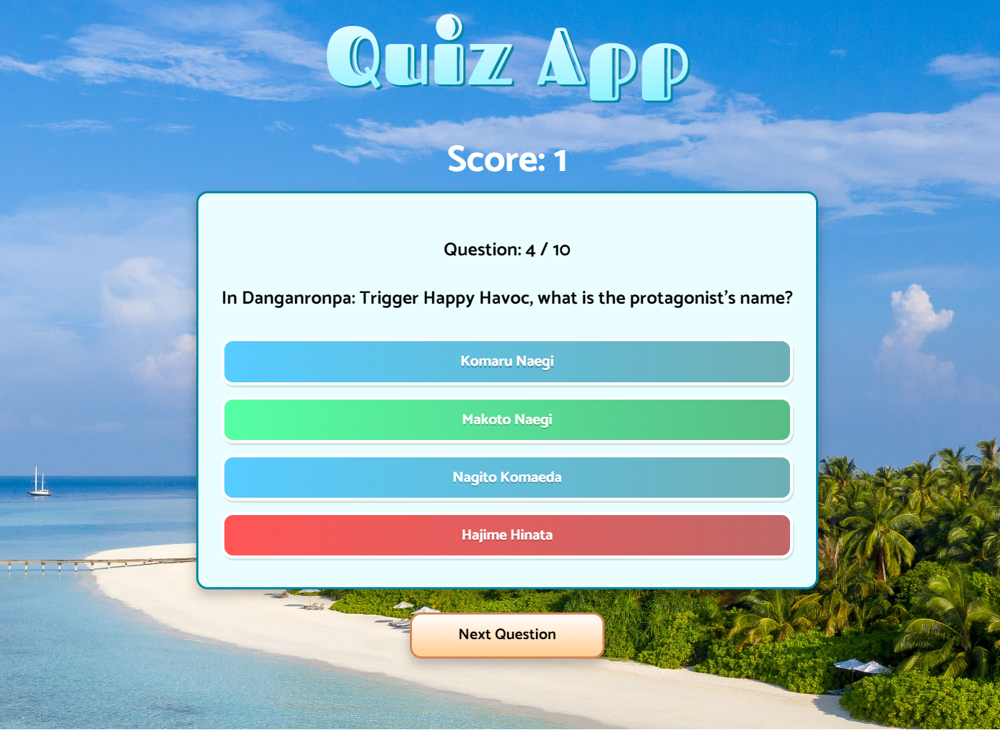
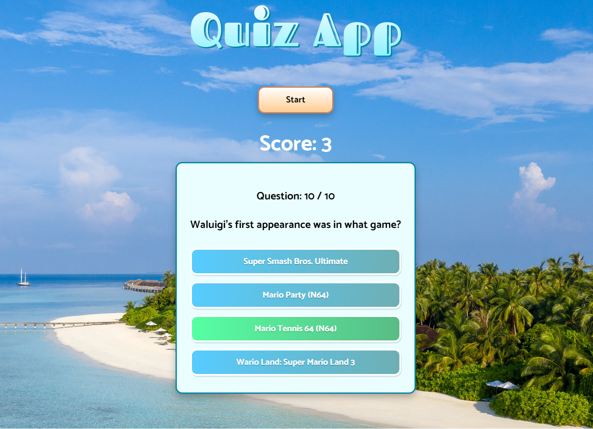

# React.js-Typescript-QuizApp

## Table of content

&nbsp;&nbsp;&nbsp; [About Project](#about-project)\
&nbsp;&nbsp;&nbsp; [Screenshots](#screenshots)\
&nbsp;&nbsp;&nbsp; [Technologies Used](#technologies-used)\
&nbsp;&nbsp;&nbsp; [Prerequisites](#prerequisites)\
&nbsp;&nbsp;&nbsp; [Installation](#installation)\
&nbsp;&nbsp;&nbsp; [Usage](#usage)\
&nbsp;&nbsp;&nbsp; [Acknowledgments](#acknowledgments)

## About Project

This is a React.js quiz app that using [Trivia API](https://opentdb.com/api_config.php)

## Screenshots

## Technologies Used

- React.js
- TypeScript
- ESLint
- Prettier

## Prerequisites

You will need to have Node.js and npm installed on your machine.

## Installation

To get started with this project, follow the steps below:

1. Clone the repository to your local machine:\
   &nbsp;&nbsp;&nbsp;&nbsp;&nbsp;&nbsp; `git clone https://github.com/yshvchnk/React.js-Typescript-QuizApp.git`

2. Navigate to the project directory:\
   &nbsp;&nbsp;&nbsp;&nbsp;&nbsp;&nbsp; `cd React.js-Typescript-QuizApp`

3. Install dependencies:\
   &nbsp;&nbsp;&nbsp;&nbsp;&nbsp;&nbsp; `npm install`

4. Start the development server:\
   &nbsp;&nbsp;&nbsp;&nbsp;&nbsp;&nbsp; `npm start`

## Usage

Open [http://localhost:3000](http://localhost:3000) with your browser to see the result.

## Acknowledgments

This project was bootstrapped with [Create React App](https://github.com/facebook/create-react-app).
